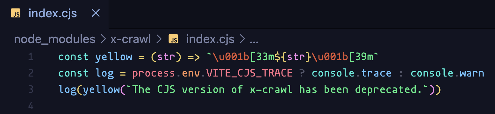
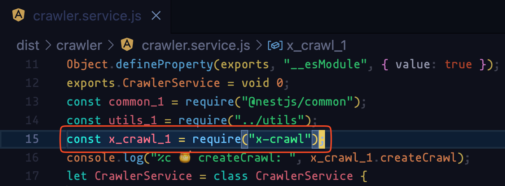

# 在 nestjs 项目中引入 x-crawl 报错（已解决）

代码位置 (已经删除无关代码)

```
src/crawler/crawler.service.ts
```

具体问题：项目引入 `x-crawl` 库，但是 `x-crawl` 只提供 ESM 模块，同时又导出了一个仅仅只输出一个警告信息的 CJS 模块。



而 nestjs 项目中虽然使用 `import { createCrawl } from 'x-crawl'` 写法引入模块，但是最终仍然是打包成 CJS 模块运行的，



因此，实际上按照常规写法仅仅是引入的 `x-crawl` 仅仅是打印一个警告信息，没有真正引入成功。

总结一下： 

在 nestjs 中 ESM 的写法经过编译之后还是变成了 CJS 的引入：

```ts
import { createCrawl } from 'x-crawl';

// 编译之后变成了 require
const x_crawl_1 = require("x-crawl");
```

而 `x-crawl` 在 `v10` 之后已经放弃对 CJS 的支持。

因此现在的问题就是要想办法**让 nestjs 引入 x-crawl 的 ESM 模块**。


## fixed

尝试过的方案：

1. 给 package.json 添加 `"type": "module"`
2. tsconfig.json 添加 `"module": "ESNext", "moduleResolution": "ESNext"` 

并没有生效，反而引发了其他的问题。


后来根据 Stack Overflow 上面的回答解决了问题：

[Compile a package that depends on ESM only library into a CommonJS package - Stack Overflow](https://stackoverflow.com/questions/70545129/compile-a-package-that-depends-on-esm-only-library-into-a-commonjs-package)

```js
const importDynamic = new Function('modulePath', 'return import(modulePath)');

importDynamic('x-crawl').then(xCrawl => {
  const { createCrawl } = xCrawl
})
```

> [Function() 构造函数 - JavaScript | MDN](https://developer.mozilla.org/zh-CN/docs/Web/JavaScript/Reference/Global_Objects/Function/Function)

成功解决问题 🎉 。